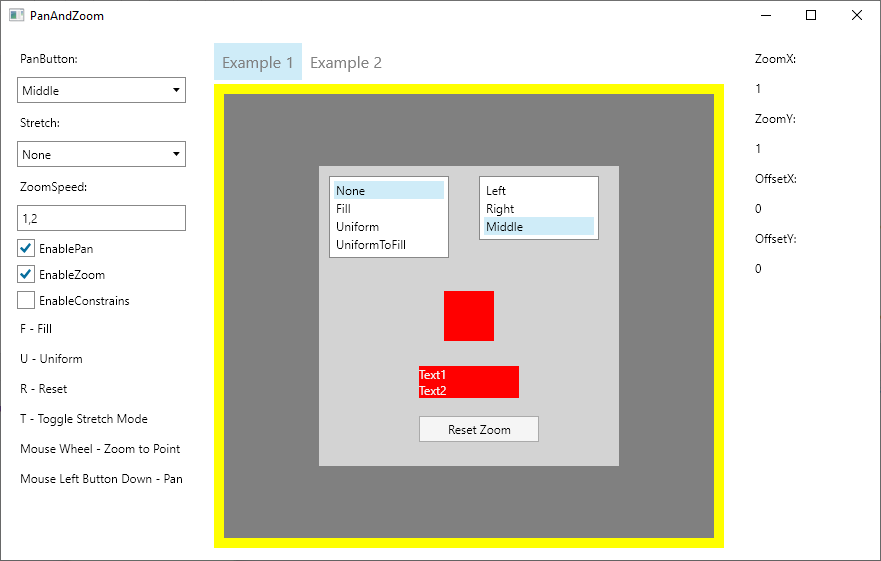

# PanAndZoom

[](https://gitter.im/wieslawsoltes/PanAndZoom?utm_source=badge&utm_medium=badge&utm_campaign=pr-badge)

[](https://dev.azure.com/wieslawsoltes/GitHub/_build/latest?definitionId=58)

[](https://www.nuget.org/packages/Avalonia.Controls.PanAndZoom)
[](https://www.nuget.org/packages/Avalonia.Controls.PanAndZoom)
[](https://www.myget.org/gallery/panandzoom-nightly) 

PanAndZoom control for Avalonia

<a href='https://youtu.be/BFLF1WPZWCQ' target='_blank'><a/>

## NuGet

PanAndZoom is delivered as a NuGet package.

You can find the NuGet packages here for [Avalonia](https://www.nuget.org/packages/Avalonia.Controls.PanAndZoom/) or by using nightly build feed:
* Add `https://www.myget.org/F/panandzoom-nightly/api/v2` to your package sources
* Alternative nightly build feed `https://pkgs.dev.azure.com/wieslawsoltes/GitHub/_packaging/Nightly/nuget/v3/index.json`
* Update your package using `PanAndZoom` feed

You can install the package for `Avalonia` based projects like this:

`Install-Package Avalonia.Controls.PanAndZoom -Pre`

### Package Dependencies

* [Avalonia](https://www.nuget.org/packages/Avalonia/)

### Package Sources

* https://api.nuget.org/v3/index.json
* https://www.myget.org/F/panandzoom-nightly/api/v2

## Resources

* [GitHub source code repository.](https://github.com/wieslawsoltes/PanAndZoom)

## Using PanAndZoom

### Avalonia

`MainWindow.xaml`
```XAML
<Window x:Class="AvaloniaDemo.MainWindow"
        xmlns="https://github.com/avaloniaui"
        xmlns:x="http://schemas.microsoft.com/winfx/2006/xaml"
        xmlns:paz="using:Avalonia.Controls.PanAndZoom"
        WindowStartupLocation="CenterScreen" UseLayoutRounding="True"
        Title="PanAndZoom" Height="640" Width="640">
    <Grid RowDefinitions="Auto,12,Auto,12,*,12" ColumnDefinitions="50,*,50">
        <StackPanel Orientation="Vertical"
                    HorizontalAlignment="Center" Grid.Row="0" Grid.Column="1">
            <TextBlock Text="F - Fill"/>
            <TextBlock Text="U - Uniform"/>
            <TextBlock Text="R - Reset"/>
            <TextBlock Text="T - Toggle Stretch Mode"/>
            <TextBlock Text="Mouse Wheel - Zoom to Point"/>
            <TextBlock Text="Mouse Left Button Down - Pan"/>
        </StackPanel>
        <StackPanel Orientation="Horizontal"
                    HorizontalAlignment="Center" Grid.Row="2" Grid.Column="1">
            <TextBlock Text="PanButton:" VerticalAlignment="Center"/>
            <ComboBox Items="{x:Static paz:ZoomBorder.ButtonNames}"
                      SelectedItem="{Binding #ZoomBorder.PanButton, Mode=TwoWay}"
                      Margin="2">
            </ComboBox>
            <TextBlock Text="Stretch:" VerticalAlignment="Center"/>
            <ComboBox Items="{x:Static paz:ZoomBorder.StretchModes}"
                      SelectedItem="{Binding #ZoomBorder.Stretch, Mode=TwoWay}"
                      Margin="2">
            </ComboBox>
            <TextBlock Text="ZoomSpeed:" VerticalAlignment="Center"/>
            <TextBox Text="{Binding #ZoomBorder.ZoomSpeed, Mode=TwoWay}"
                     TextAlignment="Center" Width="50" Margin="2"/>
            <CheckBox IsChecked="{Binding #ZoomBorder.EnablePan}"
                      Content="EnablePan" VerticalAlignment="Center"/>
            <CheckBox IsChecked="{Binding #ZoomBorder.EnableZoom}"
                      Content="EnableZoom" VerticalAlignment="Center"/>
        </StackPanel>
        <ScrollViewer Grid.Row="4" Grid.Column="1"
                      VerticalScrollBarVisibility="Auto"
                      HorizontalScrollBarVisibility="Auto">
            <paz:ZoomBorder Name="ZoomBorder" Stretch="None" ZoomSpeed="1.2"
                            Background="SlateBlue" ClipToBounds="True" Focusable="True"
                            VerticalAlignment="Stretch" HorizontalAlignment="Stretch">
                <Canvas Background="LightGray" Width="300" Height="300">
                    <Rectangle Canvas.Left="100" Canvas.Top="100" Width="50" Height="50" Fill="Red"/>
                    <StackPanel Canvas.Left="100" Canvas.Top="200">
                        <TextBlock Text="Text1" Width="100" Background="Red" Foreground="WhiteSmoke"/>
                        <TextBlock Text="Text2" Width="100" Background="Red" Foreground="WhiteSmoke"/>
                    </StackPanel>
                </Canvas>
            </paz:ZoomBorder>  
        </ScrollViewer>
    </Grid> 
</Window>
```

`MainWindow.xaml.cs`
```C#
using System.Diagnostics;
using Avalonia;
using Avalonia.Controls;
using Avalonia.Controls.PanAndZoom;
using Avalonia.Input;
using Avalonia.Markup.Xaml;

namespace AvaloniaDemo
{
    public class MainWindow : Window
    {
        private readonly ZoomBorder? _zoomBorder;

        public MainWindow()
        {
            this.InitializeComponent();
            this.AttachDevTools();

            _zoomBorder = this.Find<ZoomBorder>("ZoomBorder");
            if (_zoomBorder != null)
            {
                _zoomBorder.KeyDown += ZoomBorder_KeyDown;
                
                _zoomBorder.ZoomChanged += ZoomBorder_ZoomChanged;
            }
        }

        private void InitializeComponent()
        {
            AvaloniaXamlLoader.Load(this);
        }

        private void ZoomBorder_KeyDown(object? sender, KeyEventArgs e)
        {
            switch (e.Key)
            {
                case Key.F:
                    _zoomBorder?.Fill();
                    break;
                case Key.U:
                    _zoomBorder?.Uniform();
                    break;
                case Key.R:
                    _zoomBorder?.ResetMatrix();
                    break;
                case Key.T:
                    _zoomBorder?.ToggleStretchMode();
                    _zoomBorder?.AutoFit();
                    break;
            }
        }

        private void ZoomBorder_ZoomChanged(object sender, ZoomChangedEventArgs e)
        {
            Debug.WriteLine($"[ZoomChanged] {e.ZoomX} {e.ZoomY} {e.OffsetX} {e.OffsetY}");
        }
    }
}
```

### Getting zoom ratio

To get current zoom ratio use `ZoomX` and `ZoomY` properties. 

### Getting pan offset

To get current pan offset use `OffsetX` and `OffsetY` properties. 

### Constrain zoom ratio

To constrain zoom ratio use `MinZoomX`, `MaxZoomX`, `MinZoomY` and `MaxZoomY` properties. 

### Constrain pan offset

To constrain pan offset use `MinOffsetX`, `MaxOffsetX`, `MinOffsetY` and `MaxOffsetY` properties. 

### Enable or disable constrains

To enable or disable constrains use `EnableConstrains` flag.

## License

PanAndZoom is licensed under the [MIT license](LICENSE.TXT).
