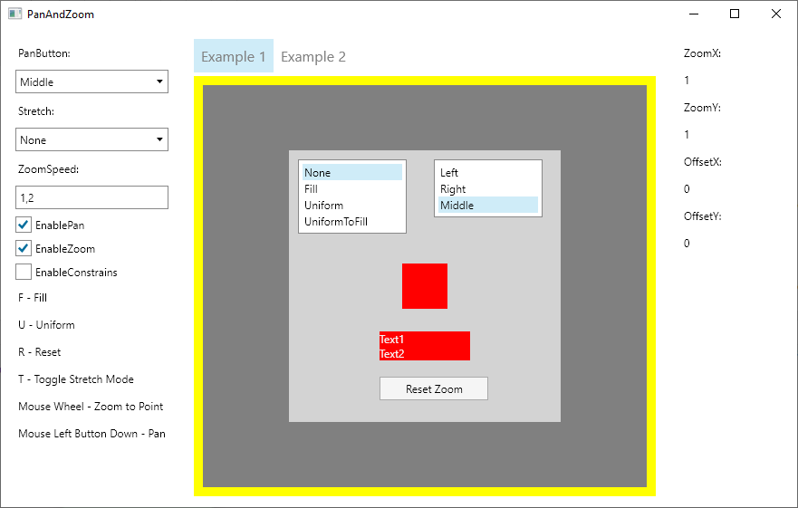

# PanAndZoom

[](https://gitter.im/wieslawsoltes/PanAndZoom?utm_source=badge&utm_medium=badge&utm_campaign=pr-badge)

[](https://github.com/wieslawsoltes/PanAndZoom/actions/workflows/build.yml)

| Package | Version | Downloads |
|---|---|---|
| `PanAndZoom` (Avalonia) | [](https://www.nuget.org/packages/PanAndZoom) | [](https://www.nuget.org/packages/PanAndZoom) |
| `PanAndZoom.Uno` (Uno Platform) | [](https://www.nuget.org/packages/PanAndZoom.Uno) | [](https://www.nuget.org/packages/PanAndZoom.Uno) |
| `PanAndZoom.Core` (shared engine) | [](https://www.nuget.org/packages/PanAndZoom.Core) | [](https://www.nuget.org/packages/PanAndZoom.Core) |

[](https://www.myget.org/gallery/panandzoom-nightly)

PanAndZoom control for Avalonia and Uno Platform.

<a href='https://youtu.be/BFLF1WPZWCQ' target='_blank'><a/>

## Packages

| Package | Target frameworks | Namespace | Use it for |
|---|---|---|---|
| [`PanAndZoom`](https://www.nuget.org/packages/PanAndZoom/) | `net8.0`, `net10.0` | `Avalonia.Controls.PanAndZoom` | The `ZoomBorder` control for Avalonia apps |
| [`PanAndZoom.Uno`](https://www.nuget.org/packages/PanAndZoom.Uno/) | `net10.0`, `net10.0-desktop`, `net10.0-browserwasm`, `net10.0-android`, `net10.0-ios`, `net10.0-windows10.0.26100` | `PanAndZoom` | The `ZoomBorder` control for Uno Platform (WinUI) apps, Skia renderer |
| [`PanAndZoom.Core`](https://www.nuget.org/packages/PanAndZoom.Core/) | `net8.0`, `net10.0` | `PanAndZoom`, `PanAndZoom.Core` | The UI framework independent engine and shared model types (referenced automatically by both controls) |

Both controls expose the same feature set (pan, zoom, stretch modes, constraints, bounds modes, wheel and keyboard behaviors, double-click zoom, gestures, animations, view history, saved views, discrete zoom levels, grid and snap, rotation, state serialization and MVVM commands) because they share one implementation.

## Architecture

PanAndZoom is built as one engine and two thin UI adapters:

```text
+----------------------------------+      +----------------------------------+
| PanAndZoom (Avalonia)            |      | PanAndZoom.Uno (Uno Platform)    |
| Avalonia.Controls.PanAndZoom     |      | namespace PanAndZoom             |
| ZoomBorder : Border              |      | ZoomBorder : Control             |
| StyledProperty, ILogicalScroll-  |      | DependencyProperty, pointer      |
| able, gesture recognizers,       |      | capture, manipulations, render   |
| Avalonia transitions             |      | loop driven MatrixTransition     |
+----------------+-----------------+      +-----------------+----------------+
                 |  IPanAndZoomHost + IPanAndZoomSettings   |
                 v                                          v
+----------------------------------------------------------------------------+
| PanAndZoom.Core (net8.0, net10.0, no UI framework dependency)              |
| PanAndZoom.Core: PanAndZoomEngine, IPanAndZoomHost, IPanAndZoomSettings,   |
|   PanAndZoomSettings, ZoomBorderDefaults, CoreMatrix, CorePoint, CoreRect, |
|   CoreSize, CoreVector, CoreThickness, MatrixMath, MatrixTransition,       |
|   ZoomBorderCommand, core event data records                               |
| PanAndZoom: StretchMode, ButtonName, ContentBoundsMode, ... ZoomChanged*   |
+----------------------------------------------------------------------------+
```

- `PanAndZoom.Core.PanAndZoomEngine` owns the transform matrix, view history, saved views and gesture state, and implements every pan, zoom, rotation, constraint, bounds and input rule. It has no UI framework dependency.
- `PanAndZoom.Core.IPanAndZoomHost` is implemented by each control: it reports viewport and child sizes, applies the computed render transform and forwards the virtual extension points (`GetContentBounds`, `ValidateTransform`, `OnResized`, `CalculateAutoZoomLimits`).
- `PanAndZoom.Core.IPanAndZoomSettings` is implemented by each control on top of its bindable properties, so the engine always reads live property values. `PanAndZoomSettings` is a plain implementation initialized from `ZoomBorderDefaults`.
- The controls translate native input (pointer, wheel, keyboard, gestures or manipulations) into engine calls and convert between native types (`Avalonia.Matrix`, `Microsoft.UI.Xaml.Media.Matrix`, ...) and the core primitives.
- Both controls expose the engine through their `Engine` property.

## Migrating from earlier versions

The Avalonia `ZoomBorder` public API is unchanged, but the shared model types moved to the `PanAndZoom.Core` assembly and now live in the `PanAndZoom` namespace:

`StretchMode`, `ButtonName`, `ContentBoundsMode`, `DoubleClickZoomMode`, `ResizeBehaviorMode`, `WheelBehaviorMode`, `ZoomIndicatorPosition`, `ZoomChangedEventArgs` and `ZoomChangedEventHandler`.

- C#: add `using PanAndZoom;` (or a `global using PanAndZoom;`) wherever you reference these types directly.
- XAML: property values keep working unchanged (`Stretch="Uniform"`, `PanButton="Left"`), but when you reference the enum types as elements or in markup extensions add a second namespace, for example:

  ```xml
  <UserControl xmlns:paz="using:Avalonia.Controls.PanAndZoom"
               xmlns:pz="using:PanAndZoom">
    <ComboBox>
      <pz:DoubleClickZoomMode>ZoomIn</pz:DoubleClickZoomMode>
      <pz:DoubleClickZoomMode>ZoomOut</pz:DoubleClickZoomMode>
    </ComboBox>
  </UserControl>
  ```

- `ZoomBorderCommand` moved to `PanAndZoom.Core.ZoomBorderCommand` (public).
- New: `ZoomBorder.Engine` exposes the underlying `PanAndZoom.Core.PanAndZoomEngine`.

## NuGet

PanAndZoom is delivered as NuGet packages.

You can find the NuGet packages here for [Avalonia](https://www.nuget.org/packages/PanAndZoom/), [Uno Platform](https://www.nuget.org/packages/PanAndZoom.Uno/) and the [shared core engine](https://www.nuget.org/packages/PanAndZoom.Core/), or by using the nightly build feed:
* Add `https://www.myget.org/F/panandzoom-nightly/api/v2` to your package sources
* Alternative nightly build feed `https://pkgs.dev.azure.com/wieslawsoltes/GitHub/_packaging/Nightly/nuget/v3/index.json`
* Update your package using `PanAndZoom` feed

You can install the package for `Avalonia` based projects like this:

`dotnet add package PanAndZoom`

You can install the package for `Uno Platform` based projects like this:

`dotnet add package PanAndZoom.Uno`

`PanAndZoom.Core` is referenced transitively by both packages; reference it directly only when you want to build your own adapter on top of the engine.

### Package Sources

* https://api.nuget.org/v3/index.json
* https://www.myget.org/F/panandzoom-nightly/api/v2

## Resources

* [GitHub source code repository.](https://github.com/wieslawsoltes/PanAndZoom)
* [Documentation site.](https://wieslawsoltes.github.io/PanAndZoom)
* [Articles home.](site/articles/readme.md)
* [Uno Platform quickstart.](site/articles/getting-started/quickstart-uno.md)
* [Architecture.](site/articles/concepts/architecture.md)
* [Headless testing docs.](site/articles/headless-testing/readme.md)

## Using PanAndZoom (Avalonia)

`MainWindow.xaml`
```XAML
<Window x:Class="AvaloniaDemo.MainWindow"
        xmlns="https://github.com/avaloniaui"
        xmlns:x="http://schemas.microsoft.com/winfx/2006/xaml"
        xmlns:paz="using:Avalonia.Controls.PanAndZoom"
        WindowStartupLocation="CenterScreen" UseLayoutRounding="True"
        Title="PanAndZoom" Height="640" Width="640">
    <Grid RowDefinitions="Auto,12,Auto,12,*,12" ColumnDefinitions="50,*,50">
        <StackPanel Orientation="Vertical"
                    HorizontalAlignment="Center" Grid.Row="0" Grid.Column="1">
            <TextBlock Text="F - Fill"/>
            <TextBlock Text="U - Uniform"/>
            <TextBlock Text="R - Reset"/>
            <TextBlock Text="T - Toggle Stretch Mode"/>
            <TextBlock Text="Mouse Wheel - Zoom to Point"/>
            <TextBlock Text="Mouse Left Button Down - Pan"/>
        </StackPanel>
        <StackPanel Orientation="Horizontal"
                    HorizontalAlignment="Center" Grid.Row="2" Grid.Column="1">
            <TextBlock Text="PanButton:" VerticalAlignment="Center"/>
            <ComboBox ItemsSource="{x:Static paz:ZoomBorder.ButtonNames}"
                      SelectedItem="{Binding #ZoomBorder.PanButton, Mode=TwoWay}"
                      Margin="2">
            </ComboBox>
            <TextBlock Text="Stretch:" VerticalAlignment="Center"/>
            <ComboBox ItemsSource="{x:Static paz:ZoomBorder.StretchModes}"
                      SelectedItem="{Binding #ZoomBorder.Stretch, Mode=TwoWay}"
                      Margin="2">
            </ComboBox>
            <TextBlock Text="ZoomSpeed:" VerticalAlignment="Center"/>
            <TextBox Text="{Binding #ZoomBorder.ZoomSpeed, Mode=TwoWay}"
                     TextAlignment="Center" Width="50" Margin="2"/>
            <CheckBox IsChecked="{Binding #ZoomBorder.EnablePan}"
                      Content="EnablePan" VerticalAlignment="Center"/>
            <CheckBox IsChecked="{Binding #ZoomBorder.EnableZoom}"
                      Content="EnableZoom" VerticalAlignment="Center"/>
        </StackPanel>
        <ScrollViewer Grid.Row="4" Grid.Column="1"
                      VerticalScrollBarVisibility="Auto"
                      HorizontalScrollBarVisibility="Auto">
            <paz:ZoomBorder Name="ZoomBorder" Stretch="None" ZoomSpeed="1.2"
                            PanButton="Left"
                            Background="SlateBlue" ClipToBounds="True" Focusable="True"
                            VerticalAlignment="Stretch" HorizontalAlignment="Stretch">
                <Canvas Background="LightGray" Width="300" Height="300">
                    <Rectangle Canvas.Left="100" Canvas.Top="100" Width="50" Height="50" Fill="Red"/>
                    <StackPanel Canvas.Left="100" Canvas.Top="200">
                        <TextBlock Text="Text1" Width="100" Background="Red" Foreground="WhiteSmoke"/>
                        <TextBlock Text="Text2" Width="100" Background="Red" Foreground="WhiteSmoke"/>
                    </StackPanel>
                </Canvas>
            </paz:ZoomBorder>
        </ScrollViewer>
    </Grid>
</Window>
```

`MainWindow.xaml.cs`
```C#
using System.Diagnostics;
using Avalonia;
using Avalonia.Controls;
using Avalonia.Controls.PanAndZoom;
using Avalonia.Input;
using Avalonia.Markup.Xaml;
using PanAndZoom; // StretchMode, ZoomChangedEventArgs, ... (PanAndZoom.Core)

namespace AvaloniaDemo
{
    public class MainWindow : Window
    {
        private readonly ZoomBorder? _zoomBorder;

        public MainWindow()
        {
            this.InitializeComponent();
            this.AttachDevTools();

            _zoomBorder = this.Find<ZoomBorder>("ZoomBorder");
            if (_zoomBorder != null)
            {
                _zoomBorder.KeyDown += ZoomBorder_KeyDown;

                _zoomBorder.ZoomChanged += ZoomBorder_ZoomChanged;
            }
        }

        private void InitializeComponent()
        {
            AvaloniaXamlLoader.Load(this);
        }

        private void ZoomBorder_KeyDown(object? sender, KeyEventArgs e)
        {
            switch (e.Key)
            {
                case Key.F:
                    _zoomBorder?.Fill();
                    break;
                case Key.U:
                    _zoomBorder?.Uniform();
                    break;
                case Key.R:
                    _zoomBorder?.ResetMatrix();
                    break;
                case Key.T:
                    _zoomBorder?.ToggleStretchMode();
                    _zoomBorder?.AutoFit();
                    break;
            }
        }

        private void ZoomBorder_ZoomChanged(object sender, ZoomChangedEventArgs e)
        {
            Debug.WriteLine($"[ZoomChanged] {e.ZoomX} {e.ZoomY} {e.OffsetX} {e.OffsetY}");
        }
    }
}
```

## Using PanAndZoom (Uno Platform)

`PanAndZoom.Uno` targets Uno Platform 6 (`Uno.Sdk` 6.7.30) with the Skia renderer (`<UnoFeatures>SkiaRenderer;</UnoFeatures>`), which is the default for new Uno apps. The default control style ships in the package (`Themes/Generic.xaml`), so no resource dictionary has to be merged.

`MainPage.xaml`
```XAML
<Page x:Class="UnoDemo.MainPage"
      xmlns="http://schemas.microsoft.com/winfx/2006/xaml/presentation"
      xmlns:x="http://schemas.microsoft.com/winfx/2006/xaml"
      xmlns:paz="using:PanAndZoom">
    <Grid>
        <Grid.RowDefinitions>
            <RowDefinition Height="Auto"/>
            <RowDefinition Height="12"/>
            <RowDefinition Height="Auto"/>
            <RowDefinition Height="12"/>
            <RowDefinition Height="*"/>
            <RowDefinition Height="12"/>
        </Grid.RowDefinitions>
        <Grid.ColumnDefinitions>
            <ColumnDefinition Width="50"/>
            <ColumnDefinition Width="*"/>
            <ColumnDefinition Width="50"/>
        </Grid.ColumnDefinitions>
        <StackPanel Orientation="Vertical"
                    HorizontalAlignment="Center" Grid.Row="0" Grid.Column="1">
            <TextBlock Text="F - Fill"/>
            <TextBlock Text="U - Uniform"/>
            <TextBlock Text="R - Reset"/>
            <TextBlock Text="T - Toggle Stretch Mode"/>
            <TextBlock Text="Mouse Wheel - Zoom to Point"/>
            <TextBlock Text="Mouse Left Button Down - Pan"/>
            <TextBlock Text="Touch - One Finger Pan, Two Finger Pinch Zoom"/>
        </StackPanel>
        <StackPanel Orientation="Horizontal" Spacing="4"
                    HorizontalAlignment="Center" Grid.Row="2" Grid.Column="1">
            <TextBlock Text="PanButton:" VerticalAlignment="Center"/>
            <ComboBox x:Name="PanButtonComboBox"
                      SelectedItem="{Binding PanButton, ElementName=ZoomBorder, Mode=TwoWay}"/>
            <TextBlock Text="Stretch:" VerticalAlignment="Center"/>
            <ComboBox x:Name="StretchComboBox"
                      SelectedItem="{Binding Stretch, ElementName=ZoomBorder, Mode=TwoWay}"/>
            <TextBlock Text="ZoomSpeed:" VerticalAlignment="Center"/>
            <Slider Minimum="1.05" Maximum="3" StepFrequency="0.05" Width="120"
                    Value="{Binding ZoomSpeed, ElementName=ZoomBorder, Mode=TwoWay}"/>
            <CheckBox IsChecked="{Binding EnablePan, ElementName=ZoomBorder, Mode=TwoWay}"
                      Content="EnablePan" VerticalAlignment="Center"/>
            <CheckBox IsChecked="{Binding EnableZoom, ElementName=ZoomBorder, Mode=TwoWay}"
                      Content="EnableZoom" VerticalAlignment="Center"/>
        </StackPanel>
        <paz:ZoomBorder x:Name="ZoomBorder" Grid.Row="4" Grid.Column="1"
                        Stretch="None" ZoomSpeed="1.2" PanButton="Left"
                        Background="SlateBlue" ClipToBounds="True" IsTabStop="True"
                        VerticalAlignment="Stretch" HorizontalAlignment="Stretch">
            <Canvas Background="LightGray" Width="300" Height="300">
                <Rectangle Canvas.Left="100" Canvas.Top="100" Width="50" Height="50" Fill="Red"/>
                <StackPanel Canvas.Left="100" Canvas.Top="200">
                    <Border Width="100" Background="Red">
                        <TextBlock Text="Text1" Foreground="WhiteSmoke"/>
                    </Border>
                    <Border Width="100" Background="Red">
                        <TextBlock Text="Text2" Foreground="WhiteSmoke"/>
                    </Border>
                </StackPanel>
            </Canvas>
        </paz:ZoomBorder>
    </Grid>
</Page>
```

`MainPage.xaml.cs`
```C#
using System.Diagnostics;
using Microsoft.UI.Xaml.Controls;
using Microsoft.UI.Xaml.Input;
using PanAndZoom;
using Windows.System;

namespace UnoDemo;

public sealed partial class MainPage : Page
{
    public MainPage()
    {
        this.InitializeComponent();

        PanButtonComboBox.ItemsSource = ZoomBorder.ButtonNames;
        StretchComboBox.ItemsSource = ZoomBorder.StretchModes;

        ZoomBorder.KeyDown += ZoomBorder_KeyDown;
        ZoomBorder.ZoomChanged += ZoomBorder_ZoomChanged;
    }

    private void ZoomBorder_KeyDown(object sender, KeyRoutedEventArgs e)
    {
        switch (e.Key)
        {
            case VirtualKey.F:
                ZoomBorder.Fill();
                break;
            case VirtualKey.U:
                ZoomBorder.Uniform();
                break;
            case VirtualKey.R:
                ZoomBorder.ResetMatrix();
                break;
            case VirtualKey.T:
                ZoomBorder.ToggleStretchMode();
                ZoomBorder.AutoFit();
                break;
        }
    }

    private void ZoomBorder_ZoomChanged(object sender, ZoomChangedEventArgs e)
    {
        Debug.WriteLine($"[ZoomChanged] {e.ZoomX} {e.ZoomY} {e.OffsetX} {e.OffsetY}");
    }
}
```

### Uno Platform differences

The Uno `ZoomBorder` has the same members as the Avalonia control. The differences come from WinUI:

| Area | Avalonia (`Avalonia.Controls.PanAndZoom.ZoomBorder`) | Uno Platform (`PanAndZoom.ZoomBorder`) |
|---|---|---|
| Base type and content | `Border`, `Child` | Templated `Control` with `[ContentProperty]` `Child` (template part `PART_Border`) |
| Clipping | `ClipToBounds` (Avalonia property) | `ClipToBounds` dependency property, default `true` |
| Focus for keyboard navigation | `Focusable="True"` | `IsTabStop="True"` (default); the control focuses itself on pointer press |
| Geometry types | `Avalonia.Point`, `Rect`, `Size`, `Vector`, `Matrix` (`M31`/`M32`) | `Windows.Foundation.Point`, `Rect`, `Size`, `Microsoft.UI.Xaml.Media.Matrix` (`OffsetX`/`OffsetY`) |
| Vector conversions | `ScreenToContent(Vector)`, `ContentToScreen(Vector)` | `ScreenToContentVector(Point)`, `ContentToScreenVector(Point)` |
| Rotation | `Rotation` | `Rotation` (hides `UIElement.Rotation`; the content is rotated through the render matrix) |
| Read-only state | `ZoomX`, `ZoomY`, `OffsetX`, `OffsetY`, `IsZoomIndicatorVisible`, `:isPanning` pseudo class | Read-only dependency properties `ZoomX`, `ZoomY`, `OffsetX`, `OffsetY`, `IsZoomIndicatorVisible`, `IsPanning` and the `PanningStates` visual state group (`Panning` / `NotPanning`) |
| Animations | Avalonia transitions | Driven by the control through `MatrixTransition` on `CompositionTarget.Rendering`; observe `IsAnimating` and `RenderMatrix` |
| Scrolling | Implements `ILogicalScrollable` | WinUI has no `ILogicalScrollable`: `Extent`, `Viewport`, `ScrollOffset`, `CanHorizontallyScroll`, `CanVerticallyScroll`, `ScrollInvalidated` and `BringIntoView(FrameworkElement, Rect)`; `BringIntoViewRequested` from descendants is handled by panning |
| Mouse | `PanButton` drag, wheel (+ `Ctrl` / `Shift` behaviors), double click | Same, with pointer capture while panning, wheel and `DoubleTapped` |
| Touch | Avalonia pinch and scroll gesture recognizers | WinUI manipulations: one finger pans, two fingers pinch zoom and rotate |
| Matrix helpers | `Avalonia.Controls.PanAndZoom.MatrixHelper` | `PanAndZoom.MatrixHelper` (`Multiply(a, b)` applies `a` first) |

### Getting zoom ratio

To get current zoom ratio use `ZoomX` and `ZoomY` properties.

### Getting pan offset

To get current pan offset use `OffsetX` and `OffsetY` properties.

### Constrain zoom ratio

To constrain zoom ratio use `MinZoomX`, `MaxZoomX`, `MinZoomY` and `MaxZoomY` properties.

### Constrain pan offset

To constrain pan offset use `MinOffsetX`, `MaxOffsetX`, `MinOffsetY` and `MaxOffsetY` properties.

### Enable or disable constrains

To enable or disable constrains use `EnableConstrains` flag.

## Advanced Features

The snippets below use the Avalonia control. The Uno Platform control exposes the same members; replace the Avalonia geometry types with their WinUI counterparts (see [Uno Platform differences](#uno-platform-differences)) and `{Binding #ZoomBorder.X}` with `{Binding X, ElementName=ZoomBorder}`.

### Animation Support

Enable smooth animations for zoom and pan operations:

```csharp
zoomBorder.EnableAnimations = true;
zoomBorder.AnimationDuration = TimeSpan.FromMilliseconds(300);
```

### Double-Click to Zoom

Configure double-click zoom behavior:

```csharp
zoomBorder.EnableDoubleClickZoom = true;
zoomBorder.DoubleClickZoomMode = DoubleClickZoomMode.ZoomInOut; // ZoomIn, ZoomOut, ZoomInOut, ZoomToFit, None
zoomBorder.DoubleClickZoomFactor = 2.0;
```

### Content Bounds Restriction

Prevent panning beyond content boundaries:

```csharp
zoomBorder.BoundsMode = ContentBoundsMode.KeepContentVisible; // Unrestricted, KeepContentVisible, FillViewport, KeepCentered, Custom
zoomBorder.BoundsPadding = new Thickness(10);
zoomBorder.MinimumVisibleContentPercentage = 0.1; // 10% of content must remain visible
```

**Bounds Modes:**
- **Unrestricted**: No bounds checking (default)
- **KeepContentVisible**: Ensures minimum percentage of content stays visible
- **FillViewport**: Centers small content and prevents empty space for large content
- **KeepCentered**: Always keeps content centered
- **Custom**: Override `GetContentBounds()` and `ValidateTransform()` for custom logic

### Resize Behavior

Control how the view adjusts when the control is resized:

```csharp
zoomBorder.ResizeBehavior = ResizeBehaviorMode.MaintainCenter; // None, MaintainCenter, MaintainTopLeft, MaintainZoom, ReapplyStretch, Custom
```

**Resize Modes:**
- **None**: No special handling (default)
- **MaintainCenter**: Keeps the center point stable during resize
- **MaintainTopLeft**: Keeps the top-left position stable
- **MaintainZoom**: Maintains zoom level and adjusts position proportionally
- **ReapplyStretch**: Reapplies the current stretch mode (calls AutoFit)
- **Custom**: Override `OnResized(Size oldSize, Size newSize)` for custom logic

### Configurable Wheel Behavior

Customize mouse wheel behavior with modifier key support:

```csharp
zoomBorder.WheelBehavior = WheelBehaviorMode.Zoom; // Zoom, PanVertical, PanHorizontal, None
zoomBorder.WheelWithCtrl = WheelBehaviorMode.Zoom;
zoomBorder.WheelWithShift = WheelBehaviorMode.PanHorizontal;
zoomBorder.WheelZoomSensitivity = 1.0;
zoomBorder.WheelPanSensitivity = 1.0;
```

**Wheel Modes:**
- **Zoom**: Zoom in/out (default)
- **PanVertical**: Pan up/down
- **PanHorizontal**: Pan left/right
- **None**: Disable wheel

**Example:** By default, `Shift`+`Wheel` pans horizontally while regular wheel zooms.

### Keyboard Navigation

Navigate and zoom using keyboard shortcuts:

```csharp
zoomBorder.EnableKeyboardNavigation = true;
zoomBorder.KeyboardPanStep = 50.0;
zoomBorder.KeyboardZoomStep = 1.1;
```

**Built-in Keyboard Shortcuts:**
- **Arrow Keys**: Pan in the respective direction
- **`+` / `=`**: Zoom in
- **`-`**: Zoom out
- **`Ctrl` + `0`**: Reset view to identity matrix
- **`Home`**: Fit content to viewport
- **`Ctrl` + `Left`**: Navigate back in view history
- **`Ctrl` + `Right`**: Navigate forward in view history

### View History (Undo/Redo)

Track navigation history with undo/redo support:

```csharp
zoomBorder.EnableViewHistory = true;
zoomBorder.ViewHistorySize = 50; // Maximum history entries

// Navigate through history
if (zoomBorder.CanNavigateBack)
    zoomBorder.NavigateBack();

if (zoomBorder.CanNavigateForward)
    zoomBorder.NavigateForward();

// Clear history
zoomBorder.ClearViewHistory();

// Listen for history changes
zoomBorder.ViewHistoryChanged += (sender, args) =>
{
    // Update UI state for back/forward buttons
};
```

### Center On Methods

Programmatically center the viewport on specific points, rectangles, or elements:

```csharp
// Center on a point in content coordinates
zoomBorder.CenterOn(new Point(100, 100));

// Center on a point with specific zoom
zoomBorder.CenterOn(new Point(100, 100), zoom: 2.0);

// Center on a rectangle (automatically calculates appropriate zoom)
zoomBorder.CenterOn(new Rect(50, 50, 200, 150));

// Center on a control element
var targetControl = this.FindControl<Control>("MyElement");
zoomBorder.CenterOn(targetControl);

// Add padding when centering
zoomBorder.CenterPadding = new Thickness(20);
```

### Coordinate System Helpers

Convert between viewport and content coordinate systems:

```csharp
// Point conversions
Point contentPoint = zoomBorder.ViewportToContent(viewportPoint);
Point viewportPoint = zoomBorder.ContentToViewport(contentPoint);

// Rectangle conversions
Rect contentRect = zoomBorder.ViewportToContent(viewportRect);
Rect viewportRect = zoomBorder.ContentToViewport(contentRect);

// Vector conversions
Vector contentVector = zoomBorder.ScreenToContent(screenVector);
Vector screenVector = zoomBorder.ContentToScreen(contentVector);

// Size conversions
Size contentSize = zoomBorder.ScreenToContent(screenSize);
Size screenSize = zoomBorder.ContentToScreen(contentSize);

// Get transformation matrices
Matrix contentToScreen = zoomBorder.GetContentToScreenMatrix();
Matrix screenToContent = zoomBorder.GetScreenToContentMatrix();

// Get bounds
Rect visibleContent = zoomBorder.GetVisibleContentBounds();
Rect viewport = zoomBorder.GetViewportBounds();
```

### MVVM Command Support

Use built-in ICommand implementations for MVVM scenarios:

```xml
<paz:ZoomBorder Name="ZoomBorder">
    <!-- Your content -->
</paz:ZoomBorder>

<StackPanel>
    <Button Content="Zoom In" Command="{Binding #ZoomBorder.ZoomInCommand}"/>
    <Button Content="Zoom Out" Command="{Binding #ZoomBorder.ZoomOutCommand}"/>
    <Button Content="Reset" Command="{Binding #ZoomBorder.ResetCommand}"/>
    <Button Content="Fit" Command="{Binding #ZoomBorder.FitCommand}"/>
    <Button Content="Fill" Command="{Binding #ZoomBorder.FillCommand}"/>
    <Button Content="Uniform" Command="{Binding #ZoomBorder.UniformCommand}"/>
    <Button Content="Uniform To Fill" Command="{Binding #ZoomBorder.UniformToFillCommand}"/>
    <Button Content="Back" Command="{Binding #ZoomBorder.NavigateBackCommand}"/>
    <Button Content="Forward" Command="{Binding #ZoomBorder.NavigateForwardCommand}"/>
    <Button Content="Toggle Stretch" Command="{Binding #ZoomBorder.ToggleStretchCommand}"/>
</StackPanel>
```

**Available Commands:**
- `ZoomInCommand` - Zoom in at center
- `ZoomOutCommand` - Zoom out at center
- `ResetCommand` - Reset to identity matrix
- `FitCommand` - Fit content to viewport
- `FillCommand` - Fill viewport
- `UniformCommand` - Apply uniform stretch
- `UniformToFillCommand` - Apply uniform to fill stretch
- `NavigateBackCommand` - Navigate back in history
- `NavigateForwardCommand` - Navigate forward in history
- `ToggleStretchCommand` - Cycle through stretch modes

All commands respect `EnableZoom`, `EnablePan`, and `EnableViewHistory` settings.

### Virtual Methods for Custom Behavior

Override these methods to implement custom logic:

```csharp
public class CustomZoomBorder : ZoomBorder
{
    protected override Rect GetContentBounds()
    {
        // Return custom content bounds for Custom BoundsMode
        return base.GetContentBounds();
    }

    protected override bool ValidateTransform(Matrix newMatrix)
    {
        // Validate proposed transform matrix
        return base.ValidateTransform(newMatrix);
    }

    protected override void OnResized(Size oldSize, Size newSize)
    {
        // Custom resize handling for Custom ResizeBehavior
        base.OnResized(oldSize, newSize);
    }
}
```

### Zoom to Rectangle

Zoom to fit or exactly match specific content rectangles:

```csharp
// Zoom to fit a rectangle in the viewport
var contentRect = new Rect(100, 100, 200, 150);
zoomBorder.ZoomToRectangle(contentRect);

// Zoom with padding
zoomBorder.ZoomToRectangle(contentRect, padding: new Thickness(20));

// Zoom to exact viewport dimensions
var viewportRect = new Rect(50, 50, 300, 200);
zoomBorder.ZoomToRectangleExact(contentRect, viewportRect);
```

### Saved Views

Save and restore named view states for quick navigation:

```csharp
// Save the current view
zoomBorder.SaveView("DetailView", "Close-up of the detail section");

// Restore a saved view
bool restored = zoomBorder.RestoreView("DetailView");

// Get saved view information
SavedView? view = zoomBorder.GetSavedView("DetailView");
if (view.HasValue)
{
    Console.WriteLine($"Name: {view.Value.Name}");
    Console.WriteLine($"Description: {view.Value.Description}");
    Console.WriteLine($"Saved at: {view.Value.Timestamp}");
}

// List all saved views
string[] viewNames = zoomBorder.GetSavedViewNames();
var allViews = zoomBorder.GetSavedViews();

// Delete a saved view
zoomBorder.DeleteSavedView("DetailView");

// Clear all saved views
zoomBorder.ClearSavedViews();
```

### Discrete Zoom Levels

Enable predefined zoom levels for consistent, predictable zooming:

```csharp
// Enable discrete zoom levels
zoomBorder.EnableDiscreteZoomLevels = true;

// Use default levels: 0.25, 0.5, 0.75, 1.0, 1.5, 2.0, 3.0, 4.0, 6.0, 8.0
// Or set custom levels
zoomBorder.DiscreteZoomLevels = new[] { 0.5, 1.0, 2.0, 4.0, 8.0 };

// Navigate between levels
double nextLevel = zoomBorder.GetNextDiscreteZoomLevel();
double previousLevel = zoomBorder.GetPreviousDiscreteZoomLevel();
double nearestLevel = zoomBorder.GetNearestDiscreteZoomLevel(1.3); // Returns 1.0

// Zoom to specific level
zoomBorder.ZoomToLevel(2.0, centerX: 100, centerY: 75);
```

When `EnableDiscreteZoomLevels` is enabled, all zoom operations will snap to the nearest discrete level.

### Viewport Culling Support

Query visibility for performance optimization and UI updates:

```csharp
// Check if a rectangle is visible in the viewport
var rect = new Rect(100, 100, 50, 50);
bool isVisible = zoomBorder.IsRectangleVisible(rect);

// Check if a point is visible
var point = new Point(150, 150);
bool isPointVisible = zoomBorder.IsPointVisible(point);

// Get the visible portion of a rectangle
Rect visiblePortion = zoomBorder.GetVisiblePortion(rect);

// Example: Conditionally render items based on visibility
foreach (var item in items)
{
    if (zoomBorder.IsRectangleVisible(item.Bounds))
    {
        RenderItem(item);
    }
}
```

### Dynamic Zoom Limits

Automatically calculate zoom limits based on content and viewport size:

```csharp
// Enable auto-calculation of minimum zoom (prevents zooming out beyond content fit)
zoomBorder.AutoCalculateMinZoom = true;

// Enable auto-calculation of maximum zoom (prevents excessive zoom-in)
zoomBorder.AutoCalculateMaxZoom = true;

// Set maximum zoom pixel size (1 content pixel = N screen pixels)
zoomBorder.MaxZoomPixelSize = 4.0; // Default is 4.0

// The effective zoom limits will be automatically calculated and applied
// MinZoom will be set to fit the content in the viewport
// MaxZoom will be set to MaxZoomPixelSize
```

**Benefits:**
- Content-aware zoom constraints
- Prevents over-zooming and under-zooming
- Better default behavior for varying content sizes

### Scale Indicator

Display current zoom level with helper methods for custom indicators:

```csharp
// Enable zoom indicator (note: rendering must be implemented separately)
zoomBorder.ShowZoomIndicator = true;

// Configure indicator position
zoomBorder.ZoomIndicatorPosition = ZoomIndicatorPosition.BottomRight; // TopLeft, TopRight, BottomLeft, BottomRight, Custom

// Set display format
zoomBorder.ZoomIndicatorFormat = "{0:P0}"; // "100%" (default)
zoomBorder.ZoomIndicatorFormat = "{0:F1}x"; // "1.5x"

// Configure auto-hide duration
zoomBorder.ZoomIndicatorAutoHideDuration = TimeSpan.FromSeconds(2);

// Get formatted zoom indicator text
string zoomText = zoomBorder.GetZoomIndicatorText();
```

**Note:** The `ShowZoomIndicator` property provides the configuration, but rendering must be implemented using adorners or custom controls that call `GetZoomIndicatorText()`.

### Grid and Snap

Enable grid display and snap-to-grid functionality:

```csharp
// Show grid overlay (note: rendering must be implemented separately)
zoomBorder.ShowGrid = true;

// Enable snap-to-grid for positioning
zoomBorder.EnableSnapToGrid = true;

// Configure grid
zoomBorder.GridSize = 50.0; // Grid spacing in content coordinates
zoomBorder.GridBrush = Brushes.LightGray;
zoomBorder.GridThickness = 1.0;
zoomBorder.GridOpacity = 0.3;

// Configure major grid lines (every N grid units)
zoomBorder.MajorGridInterval = 5;
zoomBorder.MajorGridBrush = Brushes.Gray;
zoomBorder.MajorGridThickness = 2.0;

// Use snap-to-grid methods
double snappedValue = zoomBorder.SnapToGrid(123.5); // Returns 100.0 or 150.0
Point snappedPoint = zoomBorder.SnapToGrid(new Point(123.5, 67.3));
Rect snappedRect = zoomBorder.SnapToGrid(new Rect(10, 20, 100, 80));
```

**Note:** The `ShowGrid` property provides the configuration, but grid rendering must be implemented using adorners or custom rendering that uses the grid properties and coordinate conversion methods.

**Snap Methods:**
- `SnapToGrid(double)` - Snap a single value to the nearest grid point
- `SnapToGrid(Point)` - Snap a point to the nearest grid intersection
- `SnapToGrid(Rect)` - Snap a rectangle's corners to the nearest grid points

### Rotation Support

Enable rotation support with constraints and snapping:

```csharp
// Enable rotation gesture
zoomBorder.EnableGestureRotation = true;

// Set rotation constraints
zoomBorder.MinRotation = -180.0;
zoomBorder.MaxRotation = 180.0;

// Enable rotation snapping
zoomBorder.EnableRotationSnapping = true;
zoomBorder.RotationSnapAngle = 45.0; // Snap to 45° increments

// Rotate content
zoomBorder.Rotate(45.0); // Rotate by 45 degrees
zoomBorder.RotateAt(90.0, new Point(100, 100)); // Rotate around a point

// Reset rotation
zoomBorder.ResetRotation();

// Snap current rotation to nearest angle
zoomBorder.SnapRotation();

// Get current rotation
double currentRotation = zoomBorder.Rotation;
```

**Note:** The current implementation provides rotation state management and constraints. Full rotation transformation would require additional matrix modifications.

### Multi-Touch Configuration

Configure multi-touch gesture behavior:

```csharp
// Enable simultaneous pan and zoom
zoomBorder.EnableSimultaneousPanZoom = true; // Default: true

// Configure touch point limits
zoomBorder.MinimumTouchPoints = 1;
zoomBorder.MaximumTouchPoints = 2;

// Set gesture recognition delay
zoomBorder.GestureRecognitionDelay = TimeSpan.FromMilliseconds(50);
```

### Accessibility Support

Provide screen reader support and accessibility descriptions:

```csharp
// Update accessibility descriptions
zoomBorder.UpdateAccessibilityDescriptions();

// Get accessibility description
string description = zoomBorder.GetAccessibilityDescription();
// Returns: "Zoom level: 100%. Pan position: X=0, Y=0"

// Access individual descriptions
string zoomInfo = zoomBorder.ZoomLevelDescription;
string panInfo = zoomBorder.PanPositionDescription;

// Enable high contrast mode support
zoomBorder.UseHighContrastMode = true;
```

**Accessibility Features:**
- Automatic zoom level descriptions for screen readers
- Pan position descriptions
- High contrast mode support
- Custom accessibility text via properties

### State Serialization

Export and import complete control state for persistence or sharing:

```csharp
// Export current state
ZoomBorderState state = zoomBorder.ExportState();

// State includes:
// - Transformation matrix
// - Stretch mode
// - Zoom speed
// - Enable flags (pan, zoom)
// - Rotation angle
// - Zoom limits
// - Animation settings
// - Timestamp

// Import state
zoomBorder.ImportState(state, animate: true);

// Serialize to JSON (requires System.Text.Json or Newtonsoft.Json)
string json = JsonSerializer.Serialize(state);

// Deserialize from JSON
ZoomBorderState restoredState = JsonSerializer.Deserialize<ZoomBorderState>(json);
zoomBorder.ImportState(restoredState);
```

**Use Cases:**
- Save/load view configurations
- Share view states between users
- Persist user preferences
- Implement undo/redo functionality
- Session state management

## Building and Testing

The repository uses the .NET 10 SDK (see `global.json`, which also pins `Uno.Sdk` 6.7.30) and two solutions:

| Solution | Contents |
|---|---|
| `PanAndZoom.slnx` | `PanAndZoom.Core`, `PanAndZoom` (Avalonia), `HeadlessTestingFramework`, the Avalonia sample and the Avalonia/core unit tests |
| `PanAndZoom.Uno.slnx` | `PanAndZoom.Core`, `PanAndZoom.Uno`, the Uno sample (`samples/UnoDemo`) and the Uno runtime tests |

### Avalonia and core

```bash
dotnet build PanAndZoom.slnx -c Release
dotnet test PanAndZoom.slnx -c Release
dotnet pack PanAndZoom.slnx -c Release -o artifacts/packages

# Engine unit tests only (xunit v3, no UI framework)
dotnet test tests/PanAndZoom.Core.UnitTests -c Release

# Avalonia sample
dotnet run --project samples/AvaloniaDemo.Desktop -c Release
```

### Uno Platform

The Uno library multi-targets desktop, WebAssembly, Android, iOS and Windows, so building every target needs the matching workloads:

```bash
dotnet workload install android ios wasm-tools
```

- `net10.0-android` needs the `android` workload (and an Android SDK / Java JDK).
- `net10.0-ios` needs the `ios` workload and, to build apps, macOS with Xcode.
- `net10.0-browserwasm` needs the `wasm-tools` workload.
- `net10.0-windows10.0.26100` is only added when building on Windows.

Without the workloads, restrict the target frameworks with the `PanAndZoomTargetFrameworks` property:

```bash
# Fast local build of the library (desktop only, no workloads needed)
dotnet build src/PanAndZoom.Uno -c Release -p:PanAndZoomTargetFrameworks=net10.0-desktop

# Full build of the Uno solution (workloads installed)
dotnet build PanAndZoom.Uno.slnx -c Release

# Pack PanAndZoom.Uno (all targets, workloads installed)
dotnet pack src/PanAndZoom.Uno -c Release -o artifacts/packages
```

The Uno runtime tests (`tests/PanAndZoom.Uno.RuntimeTests`) run inside a real Uno Skia desktop app using [Uno.UI.RuntimeTests.Engine](https://github.com/unoplatform/uno.ui.runtimetests.engine), so layout, templates, pointer capture, manipulations and render transforms are exercised for real:

```bash
# All tests (headless through xvfb-run on Linux, a window briefly opens on macOS/Windows)
build/run-uno-runtime-tests.sh

# Debug configuration and a filter (test class or method name fragments, '|' separated)
build/run-uno-runtime-tests.sh Debug "ZoomBorderConstraintTests | ZoomBorderTests"
```

Results are written to `artifacts/test-results/uno-runtime-tests.xml` (NUnit XML) and the script exits with a non-zero code when a test fails. See [tests/PanAndZoom.Uno.RuntimeTests/README.md](tests/PanAndZoom.Uno.RuntimeTests/README.md) for the test helpers and porting notes.

Uno sample (`samples/UnoDemo`, a port of the Avalonia demo for desktop, WebAssembly, Android, iOS and Windows):

```bash
dotnet run --project samples/UnoDemo -f net10.0-desktop
dotnet publish samples/UnoDemo -c Release -f net10.0-browserwasm -o artifacts/unodemo-wasm
```

### CI

- `.github/workflows/build.yml` (pull requests and pushes to `master`/`main`/`release/**`, superseded runs are cancelled), three jobs:
  - `Test` on Linux, Windows and macOS: builds and tests `PanAndZoom.slnx` and runs the Uno runtime tests; macOS also builds the Uno library for iOS and Android.
  - `Uno sample` on Linux: runs the sample self-test (every demo page) and publishes the WebAssembly sample.
  - `Pack` on Windows: packs all NuGet packages, including every target of `PanAndZoom.Uno` (the WinAppSDK target needs msbuild).
- `.github/workflows/release.yml`: on `v*` tags (or manual dispatch) tests `PanAndZoom.slnx` and the Uno runtime tests, packs everything on Windows and publishes all packages (`PanAndZoom`, `PanAndZoom.Core`, `PanAndZoom.Uno`, `HeadlessTestingFramework`) to NuGet.
- `.github/workflows/docs.yml`: builds and publishes the documentation site.

## Documentation

The repository includes a Lunet-based documentation site, modeled after the TreeDataGrid docs pipeline and tailored to `PanAndZoom` (Avalonia and Uno Platform), `PanAndZoom.Core` and `HeadlessTestingFramework`.

Key entry points:

- [Docs home](site/readme.md)
- [Getting Started](site/articles/getting-started/readme.md)
- [Quickstart: Uno Platform](site/articles/getting-started/quickstart-uno.md)
- [Architecture](site/articles/concepts/architecture.md)
- [Headless Testing](site/articles/headless-testing/readme.md)
- [Reference](site/articles/reference/readme.md)

Build docs locally:

```bash
./build-docs.sh
./serve-docs.sh
```

PowerShell:

```powershell
./build-docs.ps1
./serve-docs.ps1
```

Generated output is written to `site/.lunet/build/www`.

## License

PanAndZoom is licensed under the [MIT license](LICENSE.TXT).
